# CTFd Interface 2 (ctfi2) Docs

## Table of Contents
- [CTFd Interface 2 (ctfi2) Docs](#CTFd-Interface-2-ctfi2-Docs)
    - [Quick Start](#quick-start)

### Quick Start
0) ***An important note on CTFi2 behavior:***
    - All change actions (add, delete, edit) are saved to the local configuration in real time
    - When a new item is created, CTFi2 adds it to the server immediately
    - When an item is deleted, CTFi2 deletes it from the server immediately
    - When an item is edited, CTFi2 does nothing. You must right click the appropriate configuration heading and select 'sync' in order for CTFi2 to propogate your changes to the server

1) Create a Competition:
    
    - Right Click in the field under the 'CTFd Competitions' heading and choose 'New Competition'
    
        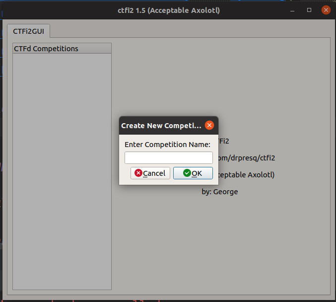
    
    - After naming your competition you will be presented with a dialog to configure the server
    
        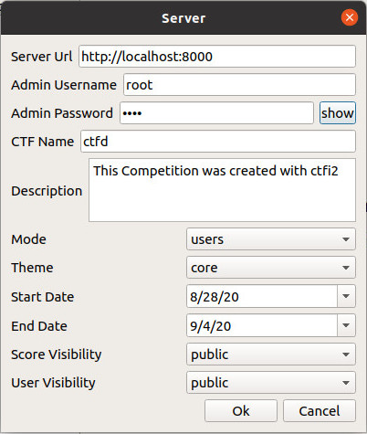
    
    - If your server instance has already been initialized you will be asked if you want to wipe the server. 
    
        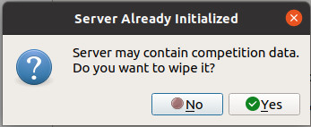
    
        - CTFi2 assumes the admin credentials provided are valid for the current server instance.
        
        - CTFi2 will automatically reinitialize the server with your chosen settings if you wipe the server. 
        
    - If you decide not to wipe existing data, you will be prompted to synchronize your local configuration with the server.
    
        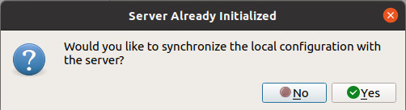
        
        - You may synchronize the local configuration with the server by choosing the sync option under the challenge or user heading context menus

2) Create a Challenge:
    - Right Click on the challenge heading and select 'Add Challenge'
    - You will be presented with the challenge dialog:
    
        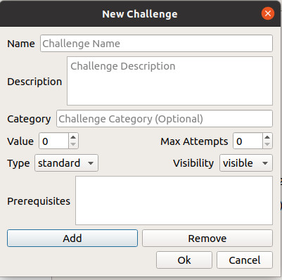
    
        - **Name**: The name of the challenge
        - **Description**: Details of the challenge
            - supports HTML and Markdown
        - **Category**: Category the challenge belongs to; the server will group challenges that share the same category when displaying the challenges
        - **Type**: CTFi2 only supports standard challenges however CTFd offers dynamic challenges as well (where the value of  a challenge decreases based on the number of times it is solved)
        - **Visibility**: (Visible/Hidden) determines whether a challenge is visible to users under normal circumstances.
        - **Prerequisites**: When there is more than one challenge in the configuration you may assign prerequisite challenges. If a challenges has prerequisites it will not be visible to your participants until they have completed all of the required challenges.
    
    - Once the challenge is created you will be able to add Flags, Hints, and Files to the challenge by right clicking on the challenge name.
    
3) Flags, Hints and Files:
    - You may add flags, hints and files to your challenge by right clicking on the challenge name.
    
    - Flags:
    
        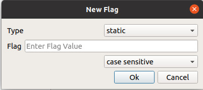
        
        - **Type**: (static/regex) Determines if the server evaluates the entered flag value as a string or a regular expression when evaluating participant submissions
        - **Flag**: The flag value; either string or regex
        - **Case**: (case sensitive/case insensitive) Determines if the server evaluates the case of the flag value when evaluating participant submissions
        
    - Hints:
    
        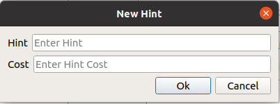
        
        - **Hint**: The hint shown to the participant if they choose to view the hint
        - **Cost**: The number of points deducted from the participant if they choose to view the hint
    
    - Files:
    
        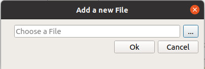
        
        - **File Picker**: Clicking the elipse ('...') will present the user with a file picker dialog where they may choose any file they wish to add to the challenge
        - The chosen file is copied to the CTFi2 data folder (/home/_username_/.ctfi2/_challengename_)
        
        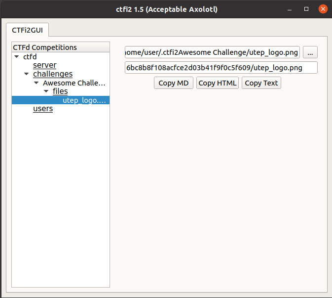
        
        - **Local Path**: The first text line shows the local path of the challenge file
        - **Remote Path**: The second text line shows the remote path of the file
        - **Copy Buttons**: The copy buttons will copy the file's remote path as a pastable link in the cooresponding format:
            - MD: \!\[_filename_\]\(_remote path_\)
            - HTML: \
            - Text: _remote path_
        
        - The copy buttons allow you to easily insert images into your challenge descriptions

4) Add a User:
    -  Right click on the Users heading and select add user
    
        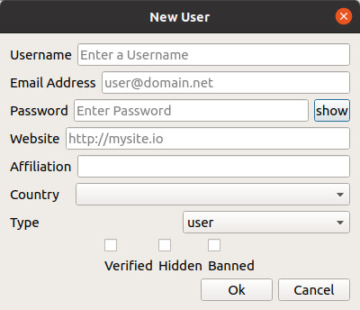
        
        - **Username**: The account username
        - **Email Address**: The account email address
            - if one is not provided CTFi2 will insert _username_@ctfd.io
            - email addresses must be unique
        - **Password**: The account password
        - **Website**: The account user's personal website if they wish to show it
        - **Affiliation**: Team / Organization Affiliation
        - **Country**: The user's country
        - **Type**: (user/admin) Determines whether the user is a regular participant or a server administrator
        - **Verified**: Manual user verification
        - **Hidden**: Determines if the user shows up in the user list or not as viewable by other participants
        - **Banned**: Prevents the account from logging into the server

5) Import Users:
    - Right click on the Users heading and select import user
    
        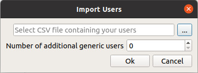
        
        - **CSV File**: Select the elipse to choose a CSV or TXT file to import
            - Valid fields are: username and email (no header row)
            - Valid separator: a single space between fields
        
        - **Additional Generic Users**: CTFi2 will create any number of additional generic accounts with the username of _userXX_ where the XX is the account record number in the server database
        
        - All passwords for accounts created under the import dialog whether from CSV or generic are generated by CTFi2
            - eight characters (uppers, lowers and numbers)
            - generated passwords are viewable in the user property view by clicking the 'show' button next to the password field
            